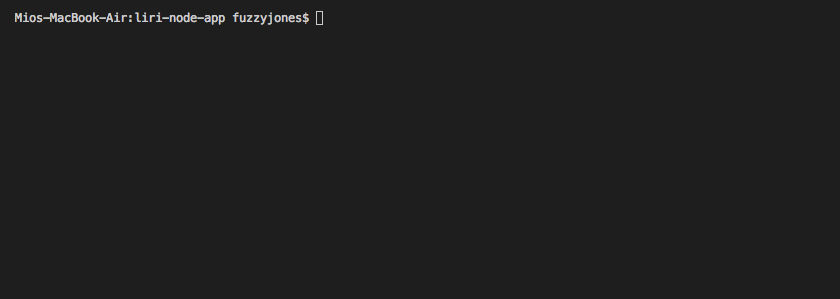

# liri-node-app

* In this assignment I created a LIRI (Language Interpretation and Recognition Interface) node app, which takes in command line parameters and returns data. This app uses npm packages to make requests to Twitter, Spotify, and OMBD.

### Instrcutions

* There are 4 different command line args that can be passed as the 3rd arg, and will return data based on the request made. The 4 possible args are as follows.   
    * `my-tweets`
    * `spotify-this-song`
    * `movie-this`
    * `do-what-it-says`
* Example command.. 'node liri.js my-tweets', will make a twitter request and return data.

### What each command does

* node liri.js my-tweets
    * Will console log tweets from a twitter account set up to demo this app.

* node liri.js spotify-this-song [any song name here]
    * Will console log the follow data from Spotify for the specified song.
        * Artist(s)
        * The song's name
        * A preview link of the song from Spotify
        * The album that the song is from

* node liri.js movie-this [any movie name here]
    * Will console log the following data from OMDB for the specified movie.
        * Title of the movie.
        * Year the movie came out.
        * IMDB Rating of the movie.
        * Rotten Tomatoes Rating of the movie.
        * Country where the movie was produced.
        * Language of the movie.
        * Plot of the movie.
        * Actors in the movie.

* node liri.js do-what-it-says
    * Will pull in a song name form the random.txt file and return data for the song 'I want it that way'.

### DEMO

